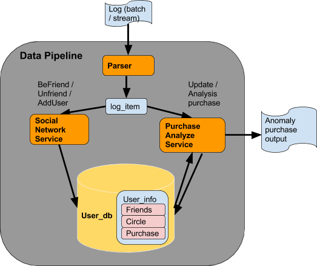

# Project Name

Coding challenge for Insight Data Engineering Followship

## Environment and Installation

This program has been developed and tested based on Python 2.7.10 under GCC 4.2.1 Compatible Apple LLVM 6.0 (clang-600.0.39) in OS X Yosemite Version 10.10.5. It's compatiable for most main stream OS platform including MacOS and Linux/Unix. 
 
In order to run it, simply pull the whole folder into local machine and launch with run.sh script.  

Dependency library includes the following, apply "pip install" when necessary:

sys
enum
sets
Queue
time
heapq
math

## Argument list

python ./src/process_log.py <input_batch_log.txt> <input_stream_log.txt> <output_anomaly_purchase.txt> 

## Design

As above image shows, this program is designed to follow what state-of-art data pipeline platform does. Main components includes three services - parser, Social Network Service and Purchase analyze service, and one “database” as Use_db. 
 
When program runs, log stream firstly passes through service parser and is translated into internal message log_item. After that, log_item is passed to Social Network Service and Purchase Analysis Service to conduct friendship and purchase update/analysis services. Database User_db is exposed for both Social Network Service and Purchase Analyze Service R/W. Database plays the role of maintaining all friendship, social circle (friends’ friendship based on given degree) and purchase record of all users. 
 
## Highlights on Social Network Service 
I applied Breadth-first-search (BFS) to update the Nth degree social network when friendship got updated (befriend or unfriend). Suppose befriend/unfriend happens between A and B,  BFS will be applied on A, B and every user of their Nth social network.
 
## Highlights on Purchase Analyze Service
In order to decide if current purchase made by user A is anomaly, I have to pull recent K purchases from A’s Nth social network. Similar as TopK problem, a heap was used to optimize the time complexity as K*O(M), where K is total purchases I want to use for analyze and M is total users in A’s Nth social network.   

## Credits

Shanshan Qin
